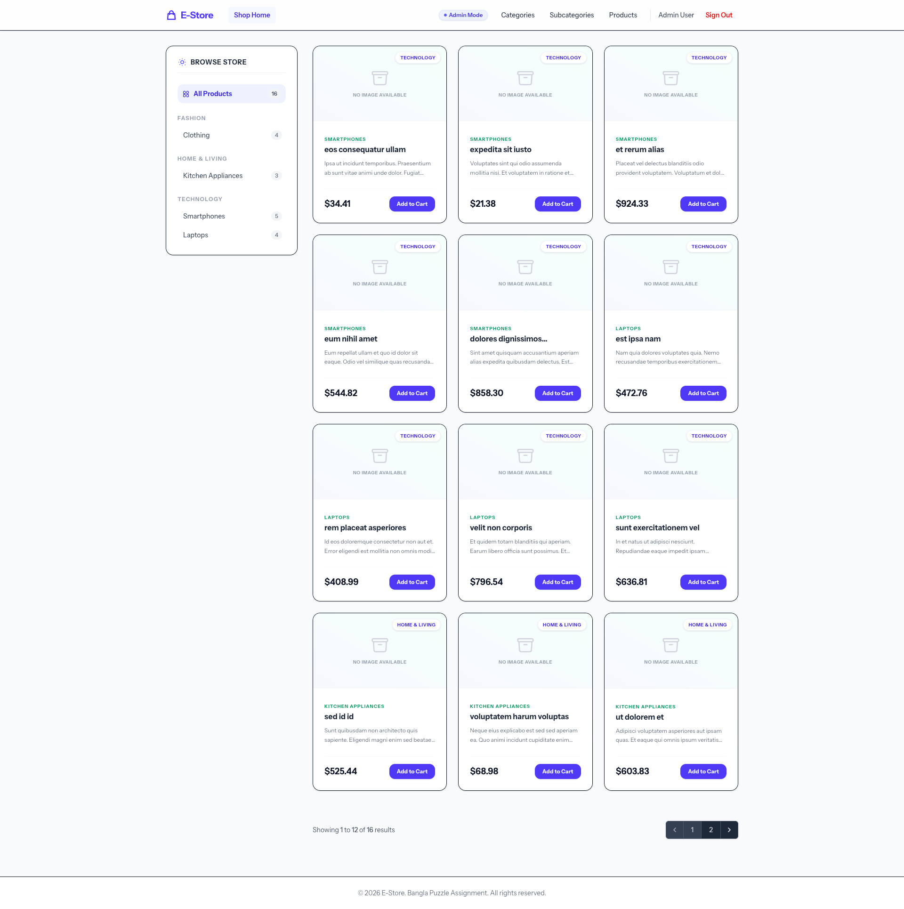
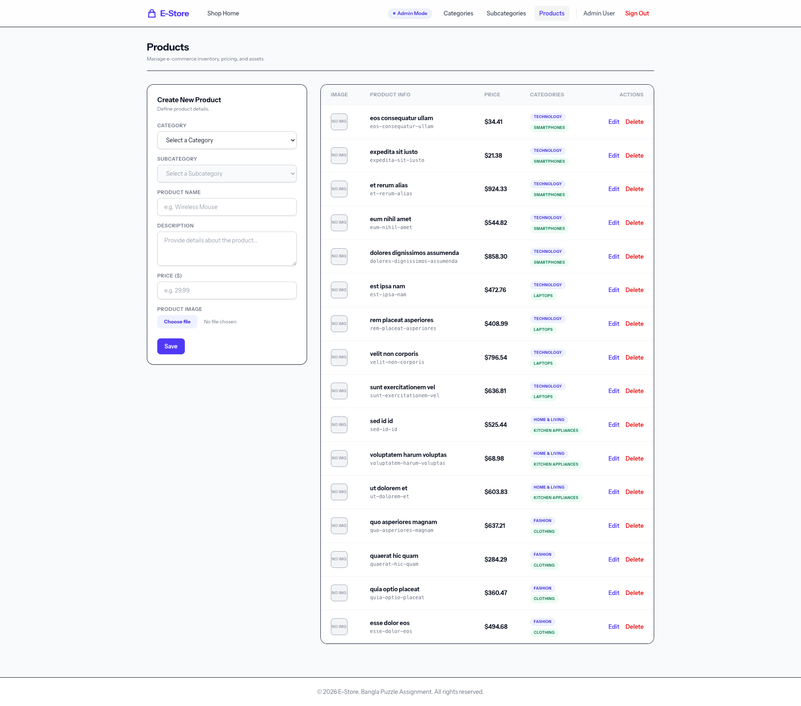

# E-Commerce Catalog & Admin Manager

A modern, highly optimized Laravel application featuring a public storefront catalog and a secure admin panel for managing categories, subcategories, and products. The project enforces best practices in design (Tailwind CSS v4), input validation (Livewire Form Objects), security (Secure Headers Middleware), performance (N+1 query prevention), and Test-Driven Development (Pest PHP).

---

## Visual Previews

### Storefront


### Admin Panel


---

## Code Structure & Architectural Approach

This project strictly follows Laravel and Livewire best practices, with a focus on modularity, readability, and performance. Below is an overview of the key directories, files, and architectural decisions.

### Directory Structure

```text
├── app/
│   ├── Http/
│   │   ├── Controllers/
│   │   │   ├── AuthController.php        # Handles Login, Register, and Logout routes
│   │   │   └── HomeController.php        # Storefront home controller (optimized eager queries)
│   │   └── Middleware/
│   │       └── EnsureSecureHeaders.php   # Inject secure HTTP response headers
│   ├── Livewire/
│   │   ├── Admin/
│   │   │   ├── CategoryManager.php       # Livewire Component for Category CRUD
│   │   │   ├── ProductManager.php        # Livewire Component for Product CRUD & Image upload
│   │   │   └── SubcategoryManager.php    # Livewire Component for Subcategory CRUD
│   │   └── Forms/Admin/
│   │       ├── CategoryForm.php          # Category Input Properties & Validation Rules
│   │       ├── ProductForm.php           # Product Input Properties & Validation Rules
│   │       └── SubcategoryForm.php       # Subcategory Input Properties & Validation Rules
│   ├── Models/
│   │   ├── Category.php                  # Category Eloquent Model (uses UUIDs)
│   │   ├── Product.php                   # Product Eloquent Model (uses UUIDs)
│   │   ├── Subcategory.php               # Subcategory Eloquent Model (uses UUIDs)
│   │   └── User.php                      # User Authenticatable Model (uses PHPDoc Type-Hints)
│   └── Traits/
│       └── HasUniqueSlug.php             # Reusable trait for automatic conflict-free slugging
├── routes/
│   └── web.php                           # Route definitions (Guest vs Protected Admin groups)
└── tests/
    └── Feature/
        ├── AuthTest.php                  # Pest tests for Login/Registration flow & protection
        ├── CategoryTest.php              # Pest tests for Category CRUD & Form validation
        ├── ProductTest.php               # Pest tests for Product CRUD, Validation & Image upload
        └── SubcategoryTest.php           # Pest tests for Subcategory CRUD & Validation
```

### Architectural Decisions

1. **Validation (Single Responsibility)**:
   Instead of writing validation rules inside Livewire component classes or controllers, all inputs and validation constraints are encapsulated in **Livewire Form Objects** (`app/Livewire/Forms/Admin/`). This keeps the component classes clean and focused solely on processing actions (saving, editing, deleting).
2. **N+1 Query Prevention**:
   Database interactions are highly optimized. Listings and relation counts are retrieved using Laravel Eloquent's eager loading (`with()` and `withCount()`). This ensures that only a fixed number of queries are run, preventing performance degradation as the database grows.
3. **Automated Slug Management**:
   The `HasUniqueSlug` trait handles all slug logic automatically during Eloquent lifecycle hook events (`creating` and `updating`). If a name is modified, a unique, conflict-free slug is computed (excluding the model's own ID during updates).
4. **Security Hardening**:
   Administrative actions are shielded by standard Laravel authentication guards. To mitigate common injection and framing vulnerabilities, we use custom middleware (`EnsureSecureHeaders`) to inject key response security headers.

---

## Technology Stack

- **Framework**: Laravel 13 & PHP 8.5
- **Frontend / Reactivity**: Livewire 4 & Alpine.js
- **Styling**: Tailwind CSS v4 (Sleek UI with dark-mode sidebar layouts, glassmorphism, and smooth hover micro-animations)
- **Database**: SQLite (using UUIDs for primary keys)
- **Testing**: Pest PHP 4
- **Formatter**: Laravel Pint

---

## Getting Started

### 1. Installation

Clone the repository, install Composer dependencies, and set up your environment:

```bash
composer install
cp .env.example .env
php artisan key:generate
```

### 2. Database Setup & Seeding

Run database migrations and seed the database with categories, subcategories, products, and a default admin user:

```bash
php artisan migrate:fresh --seed
```

### 3. Default Admin Credentials

For easy access and testing, the login screen is pre-filled with the default credentials:

* **Email**: `admin@admin.com`
* **Password**: `password`

### 4. Running the Project

Run the Vite development server to bundle assets:

```bash
npm install
npm run dev
```

The application is served by Laravel Herd (or your local PHP web server) at:
* **Storefront**: `http://bpc-assesment.test`
* **Admin Categories**: `http://bpc-assesment.test/admin/categories`

---

## Testing & Quality Assurance

### Running Tests

We use Pest PHP to verify backend controllers, middleware, and components. Run the test suite:

```bash
php artisan test --compact
```

### Code Formatting

Check and enforce coding standards using Laravel Pint:

```bash
vendor/bin/pint --format agent
```
